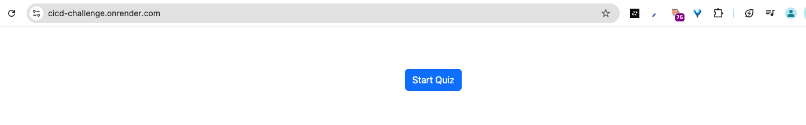
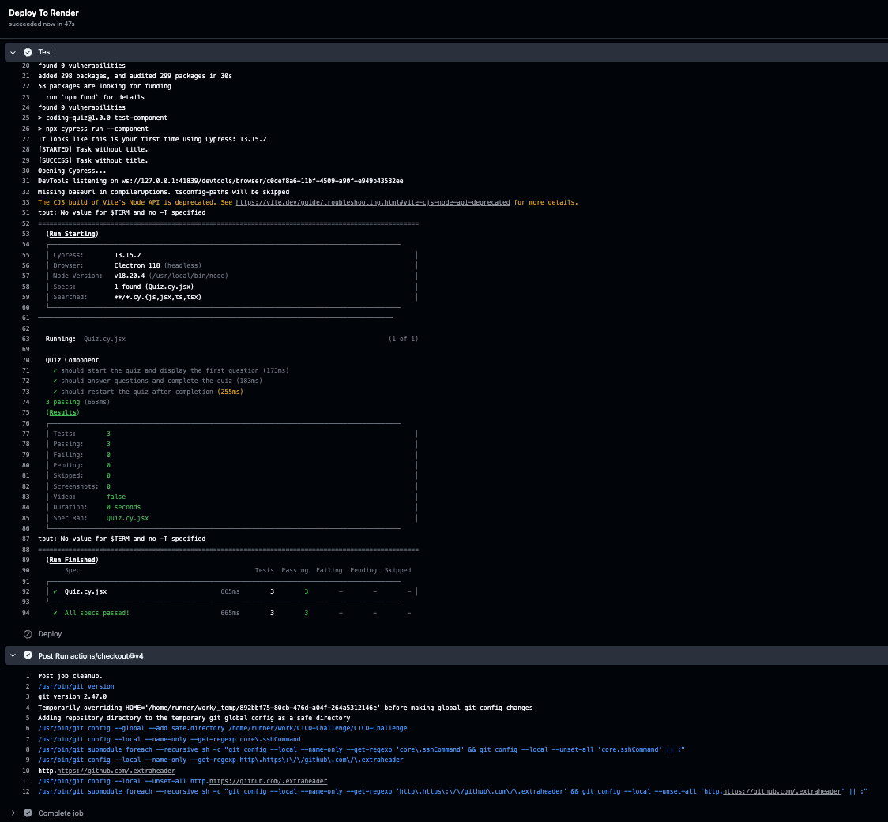

# CICD-Challenge


## Table of Contents

- [CICD-Challenge](#cicd-challenge)
  - [Table of Contents](#table-of-contents)
  - [Description](#description)
  - [Installation](#installation)
  - [Usage](#usage)
  - [Steps I took to complete the challenge](#steps-i-took-to-complete-the-challenge)
  - [Configuration](#configuration)
    - [GitHub Actions Workflow](#github-actions-workflow)
  - [Screenshot of GitHub Actions Workflow running](#screenshot-of-github-actions-workflow-running)

## Description

This project provides a hands-on challenge to implement a Continuous Integration and Continuous Deployment (CI/CD) pipeline using GitHub Actions. The pipeline ensures code quality through automated testing before merging into critical branches and automatically deploys the application to Render once merged. This challenge will build familiarity with CI/CD best practices, GitHub Actions, and automated deployment strategies.

## Installation

1. **Clone the Repository**: Download and unzip the starter code, and upload the contents to a new GitHub repository.
   ```bash
   git clone https://github.com/Robo-Ryan/CICD-Challenge
   ```

2.	Install Dependencies: Run the following command to install the necessary dependencies.
   ```bash
   npm install
   ```


## Usage

1. Develop features on separate branches and merge them into the `develop` branch for testing.
2. Create Pull Requests to the `develop` branch to trigger Cypress tests via GitHub Actions.
3. Once tests pass, merge `develop` into `main` to trigger the Render deployment.

- **When** code is merged from `develop` to `main`, **then** GitHub Actions should automatically deploy the application to Render.

## Steps I took to complete the challenge

1. **Set Up the GitHub Repository**:
   - Upload the contents of the starter code to a new GitHub repository.

2. **Deploy the Application on Render**:
   - Deploy the application to Render with MongoDB.
   - Turn off Auto-Deploy in Render’s settings and copy the Deploy hook URL for GitHub Actions.

3. **Configure Branches**:
   - Create a `develop` branch for feature merges.
   - Merge `develop` into `main` only for production-ready code.

## Configuration

### GitHub Actions Workflow

1. **Testing Workflow**:
   - Configure a `.github/workflows/test.yml` file to run Cypress tests on Pull Requests to `develop`.
  
2. **Deployment Workflow**:
   - Set up a `.github/workflows/deploy.yml` file to deploy to Render when `develop` is merged into `main`.

3. **Environment Variables**:
   - Use GitHub Secrets to securely store the Render API key and Deploy hook URL.

## Screenshot of GitHub Actions Workflow running
